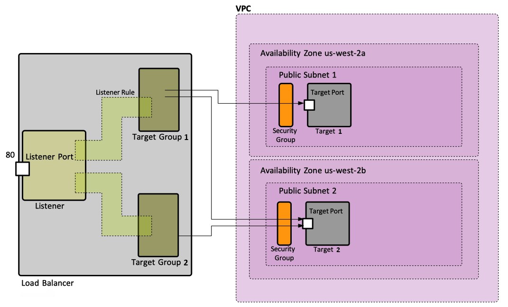

# Introduction:
This is a guide for creating an **AWS CLI script** that automates the deployment of an **Application Load Balancer (ALB)**. \
**ALB** will be configured with 2 **Target Groups**, each associated with a different **EC2 instance**. \
The **instances** will run a basic *web server with HTML content*, each **instance** with a different *path* to distinguish between them. 
> I will be using the *default VPC of the region*, along with *2 default public subnets* each in a different *availability zone*.

> Before running the scripts:  ``` $ ./example-script.sh ``` , \
give them permission to execute:  ``` $ chmod +x example-script.sh ```

# AWS Architecture Diagram :
 <br/>

# Steps:
### First:  Connecting AWS:
  ```
  $ aws configure
  ```
  Login with IAM user credentials (access/secret key) and configure default region name:
  ```
  AWS Access Key ID [None]: accesskey
  AWS Secret Access Key [None]: secretkey
  Default region name [None]: us-west-2
  Default output format [None]:
  ```
### Step 1:  Creating a Security Group:
* Allow *inbound traffic* on *port 80 (HTTP)*.
* When creating  **EC2 instances**, associated this **security group** with them. 
### Step 2:  Creating a Load Balancer:
* Create an **Application Load Balancer (ALB)**.
* Configure the **ALB** to use **2 public subnets**, one for each **availability zone**.
* Associate the previously created **security group** with the **ALB**.
### Step 3:  Creating 2 Target Groups:
* Create **2 target groups**, one for the *"/red" path* and the other for the *"/blue" path*, configure each **target group** to use *HTTP on port 80*.
### Step 4:  Creating 2 EC2 Instances:
* Launch **2 EC2 instances**, one for each **target group**.
* Associate the previously created **security group** with the **instances**.
* Install and configure *Ubuntu Server* on each *instance*.
* Create an *HTML file* on each instance ("/var/www/html/index.html") with content indicating the color associated with the instance ("/red" or "/blue").
### Step 5:  Register EC2 instances with Target Groups
* Register each EC2 instance with its corresponding Target Group.
* Make sure the instances are in a running state.
### Step 6:  Creating 2 Listeners:
* Create a **Listener** on the **Application Load Balancer (ALB)** with **rules** for "/red" & "/blue" path.
* Associate each **rule** with the respective **target group**.
### Last:  Easy destroy all:
* Create a *temp.conf* file, here we store the variables(*ID*, *ARN*) created from our main file.
* Create a *destroy-script.sh* file, here we delete all we have created in the AWS Cloud.
### Test:
* Verify the deployment by accessing the ALB's DNS name in a web browser and navigating to the "/red" and "/blue" paths.